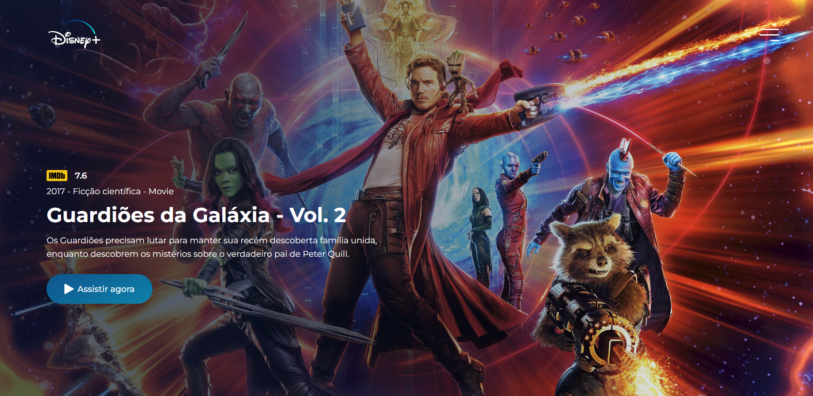

# website-api
|      MOBILE         |          DESKTOP       |
|:-------------------:|:-----------------------:
|||
|                     |                        |

[Clique aqui](https://vini01072003.github.io/Site-API/) para acessar o site!

## **Sobre** 
Site que faz uma busca por heróis em uma API de [Movies](https://www.themoviedb.org/) e mostra seus detalhes em uma página web. O objetivo deste projeto é colocar em prática os conhecimentos adquiridos no curso do [Senai Jandira](https://jandira.sp.senai.br/) na criação de web sites e adquirir conhecimento sobre outras coisas das quais não foram abordadas no curso.

---

## **Relatório de Experiência** 
A API tem uma documentação completa e é fácil de usar, o unico problema que encontrei foi juntar a minha ideia do figma com as opções de JSON que a API fornece.

---

## **Tecnologias utilizadas**
- HTML
- CSS
- JavaScript
- Markdown
- Responsividade

---

##  **Ferramentas**
- [link do Figma](https://www.figma.com/file/EvBoNh3g9P1DB8Nq04Y1Lh/Untitled?type=design&node-id=0-1&t=5Kzvu08o3LXXydYb-0)
- GitHub
- Font Awesome
- Visual Studio Code

---
## **Critérios**
- [x]  Documentou problemas, se encontrado, para futuras consultas?
- [x]  Foi criado o layout no figma?
- [x]  A página foi construída seguindo o planejado no Figma?
- [x]  A página funciona em dispositivos diferentes?
- [x]  Foi consumida a API escolhida?
- [ ]  Foi criado web componentes?
- [x]  Foi criado um padrão de roteamente para as paginas?
- [x]  As funções foram criadas seguindo à boa prática de responsabilidade única?
- [x]  Quando possível, foi criado funções puras?
- [x]  O projeto está publicado?
- [x]  Foi criado o arquivo README.md?

---
## **Autor**
- [Vinicius Alves](https://github.com/Vini01072003)  

